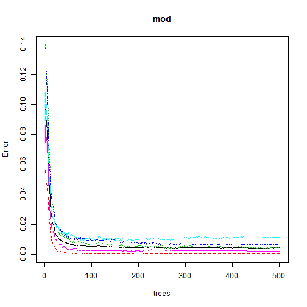
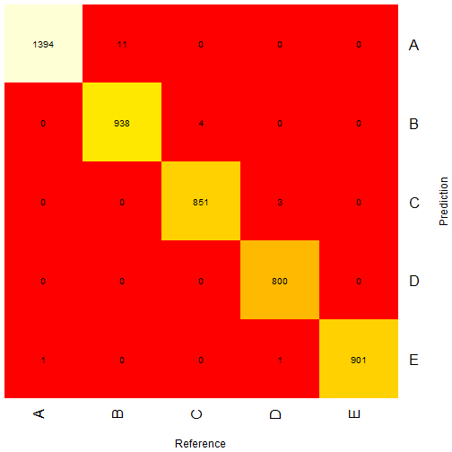

## Machine Learning Assigment - Kevin Carhart

#### Introduction

There is a growing body of machine learning experiments having to do with the use of wearable devices to measure human motion, such as the types of actions done in sports or exercise.  However, most of these studies have recognized whether something happened but have not attempted to quantify whether or not it was done well.  The present exercise builds off the work of a group at the Pontifical Catholic University of Rio de Janeiro which attempted to quantify mistakes in the course of weightlifting actions.

In the present document, we begin with the training data published by this group, containing a record of weightlifting exercises and a coding on a quality scale.  Using a random-forest machine learning technique, we will then predict this quality scale on a testing set.

The assignment asks several questions about the rationales for our decisions.  (How did you go about the process of model selection?  Why did you make the choices you did?  What was the out-of-sample error?  How did you use cross validation?)

These will be addressed throughout the report in the appropriate place, as the topics come up organically while working.

#### Preliminaries and Exploratory Steps

In case the reader is reproducing this research, please note that the very first steps are paraphrased rather than expressed literally.  We can provide the internet URLs to the csv-based data files, but as these change periodically, it is presented as a loose instruction rather than reproducible R code.  The reproducibility will begin at a designated spot further down.

Therefore, to begin, please download the following:
http://groupware.les.inf.puc-rio.br/static/har/dataset-har-PUC-Rio-ugulino.zip

The preparation of this zipped file is also left deliberately loose.  Please wrangle this file within your own filesystem.  You will eventually see a training csv, and a test csv.

At this point, we loaded the training csv file into R.  Through running str(), we concluded that the file contains many 'NA' values, as well as blanks, as well as DIV/0 designations.  Therefore, we actually loading in the training file once and did enough explorations to conclude that we would want to load the training file again, converting all of the missing-value designators into NA.

The reproducibility begins here, except that if you wish to run the following read.csv statement, you should modify the path.  Beyond this point, you should be able to run the R code as one uninterrupted sequence.  

There are two pieces of R that produce a delay.  One is the correlation plot.  The other is the call to randomForest().  The former is part of the exploratory stages, in order to assess whether principal-components analysis would be warranted.  The corrplot went into this decision, but as PCA was ultimately not used, you may want to avoid the delay by excluding the corrplot.


```r
library(corrgram)
library(caret)
library(gplots)
library(randomForest)
```

Here is the line to load pml-training.csv.  The missing values are all converted into NA, for sweeping removal, below.


```r
training <- read.csv("C:/c2/Data Science/course 8/week four/project/pml-training.csv",na.strings=c("NA","","#DIV/0!"))
```


Here are some early explorations including setting the seed.  The output of str() and names() has been inhibited since they bloat the length of the report above 2000 words, and are important explorations but do not build any variables for later steps.


```r
#str(training)
#names(training)
dim(training)
```

```
## [1] 19622   160
```

```r
set.seed(646378542)
```


Given that we wanted to reduce the dimensions of the data, we concluded that it would be helpful to eliminate any field with missing values rather than use imputation or try to pick apart those fields.  So the next steps are how these fields are removed.


```r
training_workfield1 <- which(colSums(is.na(training))>0)
training  <- training[-training_workfield1]
dim(training)
```

```
## [1] 19622    60
```

The NA fields have been removed.  We observed that every row begins with certain metadata or administrative fields which can be differentiated from the subject matter itself.  We removed these simply by hardcoding.  The total number of fields is 60, so after confirming that fields 1-7 are metadata, we remove them by specifying [8-60].


```r
names(training[1:7])
```

```
## [1] "X"                    "user_name"            "raw_timestamp_part_1"
## [4] "raw_timestamp_part_2" "cvtd_timestamp"       "new_window"          
## [7] "num_window"
```

```r
training <- training[8:60]
```


#### Is principal components analysis appropriate?

In order to determine whether or not to try to bundle some of the sets of fields together, we ran a correlation plot.  However, given the long delay, the corrgram is commented out by default.  You may enable it if you wish to run it.


```r
#corrgram(training)
```

The corrgram makes an intriguing exploration, but we did not pursue PCA.  One reason is that the researchers from Rio did not mention PCA, and to some extent we can model our work on theirs.  Another argument against PCA is that based on the names of the remaining fields, they appear to describe a nice variety of substantive and mutually exclusive observations.  There does not appear to be very much waste or overlap.  The fields are composed by a type of motion (yaw, roll, pitch), subdivided by another, substantive dimension (belt, arm, forearm, dumbbell.)  There is little waste.  These fields each pick up different enough aspects of the observations that we were satisfied with the value of each.

#### Model selection, followed by the main event

Regarding model selection, we based our work on the original.
As Velloso, Bulling et. al. say in their paper, "Because of the characteristic noise in the sensor data, we
used a Random Forest approach."  They go on to say that they used an additional ensemble of classifiers based on Bagging.  However, we began with a Random Forest, with the understanding that we would assess the accuracy of the first pass and make adjustments if necessary.  

At this point, we used caret's train command with method = "rf".  However, there was an onerous delay.  Therefore, we abandoned caret and switched to randomForest().  This was also done in one of the course quizzes, so we considered randomForest and caret's "rf" to be equally as good.

This change, in & of itself, has implications for the use of cross validation.  In the Random Forests paper by Breiman and Cutler, (see reference section) they state, "In random forests, there is no need for cross-validation or a separate test set to get an unbiased estimate of the test set error. It is estimated internally, during the run..."   

Had we continued with caret's "rf", we were prepared to use trainControl with the "cv" argument.  But because we switched to randomForest, cross validation was already addressed inline.

However, the other sense of cross validation has been addressed in the design of the exercise.  Since the outset, we had only used the training set from Rio.  The testing csv remained pristine and untouched.  The model fit was done by taking the now-reduced training file and carving it up with createDataPartition.  So we now essentially had train-train and train-test subsets.

What follows next is the core of the exercise: createDataPartition followed by the model fit, followed by predicting on the train-test subset.  Then we run the confusionMatrix and assess the accuracy of the model as of now.

The randomForest() will take around 30 seconds to complete.


```r
training_axis = createDataPartition(training$classe, p=0.75)[[1]]
training_train = training[training_axis,]
training_test = training[-training_axis,]
mod <- randomForest(classe ~ . , data=training_train)
plot(mod)
```




```r
newprediction <- predict(mod,training_test)
cm <- confusionMatrix(newprediction,training_test$classe)
cm
```

```
## Confusion Matrix and Statistics
## 
##           Reference
## Prediction    A    B    C    D    E
##          A 1394   11    0    0    0
##          B    0  938    4    0    0
##          C    0    0  851    3    0
##          D    0    0    0  800    0
##          E    1    0    0    1  901
## 
## Overall Statistics
##                                           
##                Accuracy : 0.9959          
##                  95% CI : (0.9937, 0.9975)
##     No Information Rate : 0.2845          
##     P-Value [Acc > NIR] : < 2.2e-16       
##                                           
##                   Kappa : 0.9948          
##  Mcnemar's Test P-Value : NA              
## 
## Statistics by Class:
## 
##                      Class: A Class: B Class: C Class: D Class: E
## Sensitivity            0.9993   0.9884   0.9953   0.9950   1.0000
## Specificity            0.9969   0.9990   0.9993   1.0000   0.9995
## Pos Pred Value         0.9922   0.9958   0.9965   1.0000   0.9978
## Neg Pred Value         0.9997   0.9972   0.9990   0.9990   1.0000
## Prevalence             0.2845   0.1935   0.1743   0.1639   0.1837
## Detection Rate         0.2843   0.1913   0.1735   0.1631   0.1837
## Detection Prevalence   0.2865   0.1921   0.1741   0.1631   0.1841
## Balanced Accuracy      0.9981   0.9937   0.9973   0.9975   0.9998
```


What is the accuracy as of now?  As shown in the confusionmatrix output, the overall accuracy of the model is 0.9959.  Therefore, the out-of-sample error is the complement of the accuracy, or around .0041.


```r
oos <- 1-0.9959
oos
```

```
## [1] 0.0041
```

#### The "real" predictions on the Rio testing set

Til now, the testing set from the Rio researchers remained pristine.  Now we were ready to generate the twenty predictions.  Please note that, same as above, the path given in the read.csv statement is from our own environment.  You should adjust this in order to recreate the work.


```r
testing <- read.csv("C:/c2/Data Science/course 8/week four/project/pml-testing.csv")
realprediction <- predict(mod,testing)
realprediction
```

```
##  1  2  3  4  5  6  7  8  9 10 11 12 13 14 15 16 17 18 19 20 
##  B  A  B  A  A  E  D  B  A  A  B  C  B  A  E  E  A  B  B  B 
## Levels: A B C D E
```

```r
heatmap.2(as.matrix(cm),Rowv=FALSE,Colv=FALSE,dendrogram='none',cellnote=as.matrix(cm),notecol="black",trace="none",key="FALSE",lwid=c(.01,.99),lhei=c(.01,.99),xlab="Reference",ylab="Prediction")
```



#### Conclusion

As the Rio researchers make clear, "recording all possible mistakes is a potentially infinite task, due to the complexity of human motion and all possible combinations of mistakes."  However, if you are willing to accept their assumptions and the underlying framework of their own training and testing data, the application of a random forest algorithm did a good job extrapolating from the training set and applying it to the test set.

#### REFERENCES

This is the overall URL for the Rio group:  http://groupware.les.inf.puc-rio.br/har 

Here is the citation for their paper, as they wish it to be presented: Ugulino, W.; Cardador, D.; Vega, K.; Velloso, E.; Milidiu, R.; Fuks, H. Wearable Computing: Accelerometers' Data Classification of Body Postures and Movements. Proceedings of 21st Brazilian Symposium on Artificial Intelligence. Advances in Artificial Intelligence - SBIA 2012. In: Lecture Notes in Computer Science. , pp. 52-61. Curitiba, PR: Springer Berlin / Heidelberg, 2012. ISBN 978-3-642-34458-9. DOI: 10.1007/978-3-642-34459-6_6

Here is the PDF for their paper: http://groupware.les.inf.puc-rio.br/public/papers/2013.Velloso.QAR-WLE.pdf

The documentation for Random Forest which mentions cross validation can be found at https://www.stat.berkeley.edu/~breiman/RandomForests/
